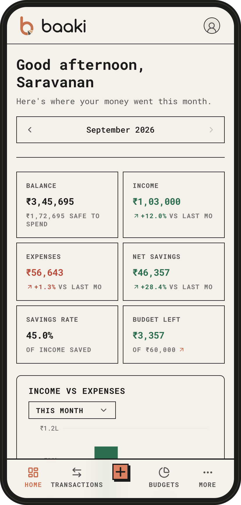
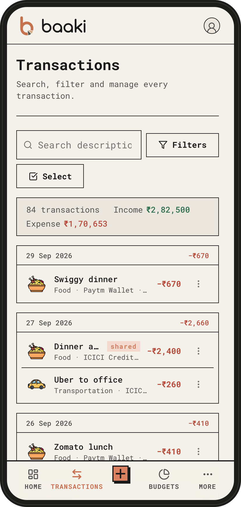
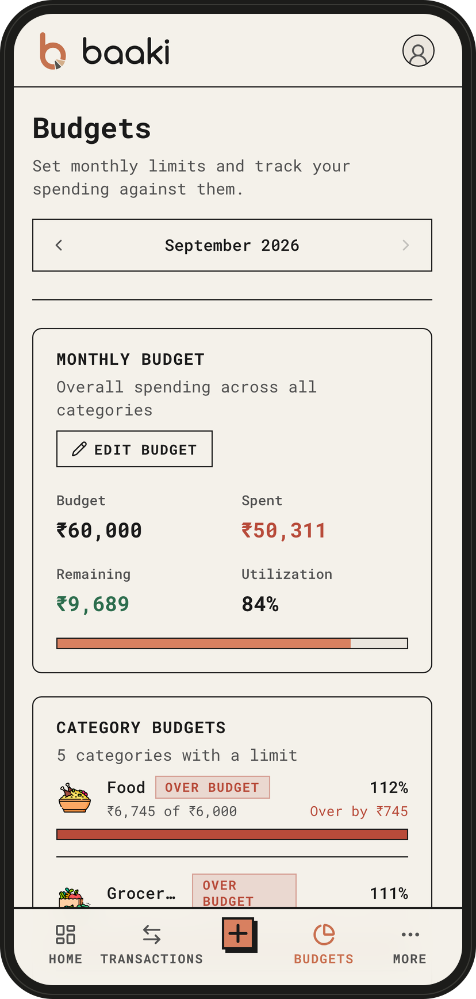
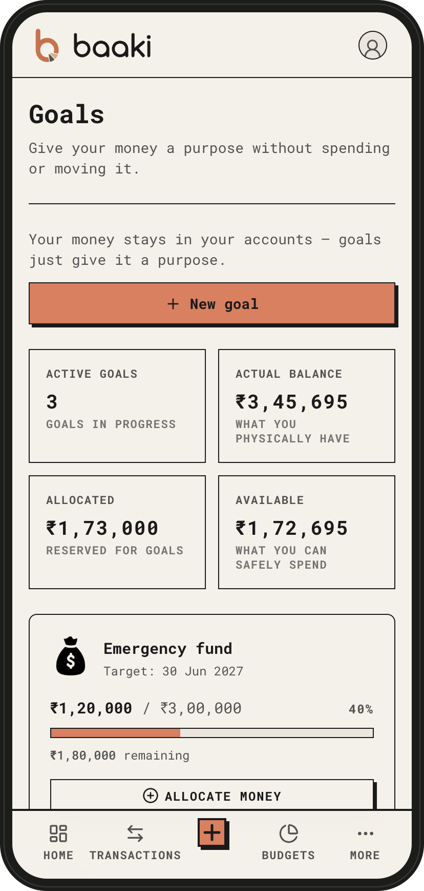

#  baaki

**Know where your money goes.**

A personal finance app for everyday money in India. It runs entirely on your Android
phone: no account, no server, nothing uploaded, and it can't reach the internet.

<p align="center">
  
  
  
  
</p>

Every screen, and a [walkthrough video](UI/walkthrough.mp4), are in [UI/](UI/README.md).

Amounts are stored in whole paise, so totals never drift. Everything is computed on the
phone; the database is Postgres compiled to WebAssembly (PGlite).

Built with Next.js (static export), TypeScript, Prisma, PGlite, Capacitor and Tailwind CSS.

## Download

**[Download the latest baaki APK](https://github.com/pvsaravanan/baaki/releases/latest)** —
for Android 7.0 or newer. Open the file on your phone to install it; Android may ask
you to allow installs from your browser or files app. Your data stays on the phone, so
take a backup from Settings now and then. Each release lists its checksum, and all
versions are on the [Releases](https://github.com/pvsaravanan/baaki/releases) page.

## Run it

```bash
npm install
npm run dev        # in a browser: http://localhost:3000
npm run android    # build and run on a connected phone or emulator
```

See [docs/SETUP.md](docs/SETUP.md) for the Android build, schema changes and testing.

## License

MIT — see [LICENSE](./LICENSE).

The profile pictures are [Open Peeps](https://www.openpeeps.com) by Pablo Stanley (CC0),
drawn with [DiceBear](https://www.dicebear.com).
